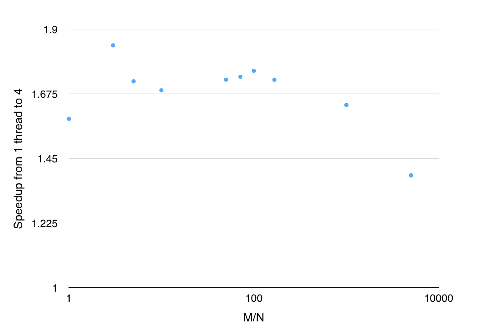

## OpenMP Annotations

The only loop I could parallelize for an performance benefit was applying the elementary reflector. The
following chart shows M/N vs speedup from 4 threads for a variety of M/N ratios. I made sure M and N
were large enough that it took at least a second to solve the problem. This should ensure there is
enough work.

For ratios up to 1000, speedup from 4 threads is roughly around 1.7x. For larger ratios, performance
starts dropping. This is because there are very few columns so parallelizing the elementary reflector
doesn't have as much to work on.

## Impediments to performance

My implementation is still not as performance as the LAPACK implementation. The most likely cause for
poor performance is lack of cache locality. In addition, performance of my implementation for large M/N
ratios (tall matrices) is very poor.

## TSQR and blocked QR

TSQR performs very well on tall skinny matrices. It typically gets within 1 GF/s of LAPACK's `dgeqrt`
and handily beats `dgeqrf`.

Blocked QR also performs well on tall skinny matrices but not quite as well as TSQR on very tall and
skinny matrices. Blocked QR performs very well on square matrices, often beating `dgeqrf` by a factor of
2 or more. Choosing the right block size has a large effect on performance. I found a block size of 100
works pretty well.
